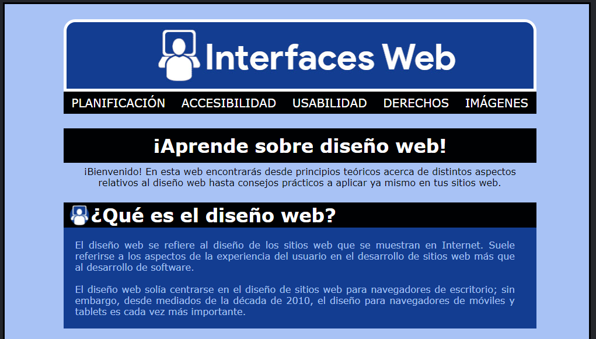

# Práctica de Maquetación 'Interfaces Web'

"Interfaces Web" es una página web estática diseñada para la asignatura homónima del ciclo **Desarrollo de Aplicaciones Web**.

## Autoría

Esta página fue diseñada por [Miguel](https://github.com/migab2801).

## Finalidad de la aplicación

El objetivo de la página es demostrar al profesor correspondiente la competencia del alumno en materia de HTML y CSS.

## Tecnologías implementadas
* HTML5
* CSS

## Contenido del repositorio
* *css*, fichero que contiene las hojas de estilo utilizadas, en formato CSS.
* *imagenes*, fichero que contiene las imágenes de la web.
* *portfolio*, fichero que contiene las distintas páginas del sitio, en formato HTML.
* *index.html*, página principal de la web.

## Finalidad del repositorio

El objetivo de este repositorio es poder realizar satisfactoriamente las prácticas correspondientes a las unidades 5 y 8 de la asignatura **Despliegue de Aplicaciones Web**.

## Vista previa de la aplicación

## Créditos
[choosealicense](https://choosealicense.com/licenses/mit/) por su plantilla MARKDOWN
